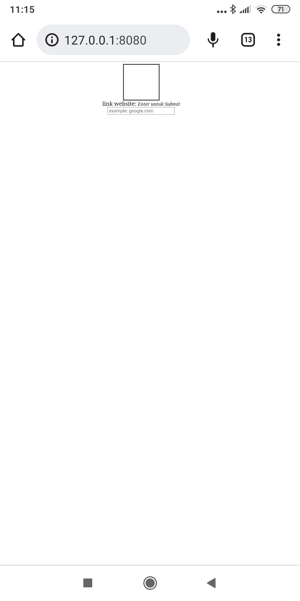
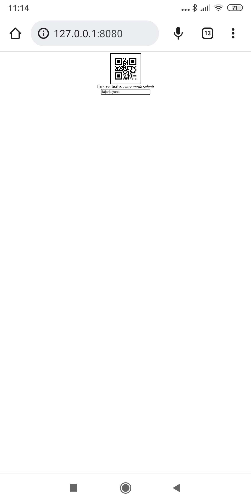

# node.js_QR-Generate
simple source generate QR code on web browser

## Screenshot
- before generate.

- after generate.

# Connect With me

[

[

 

[instagram]: https://www.instagram.com/fajar.julyana/

[linkedin]: https://linkedin.com/in/fajar-julyana-753a6>
